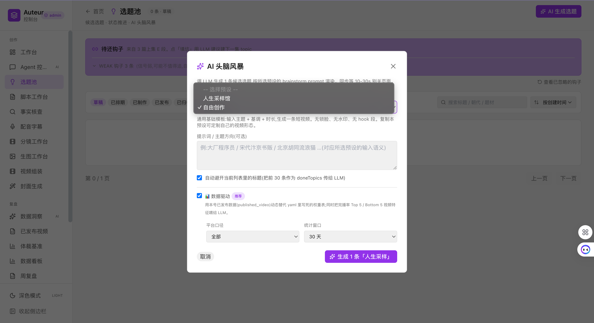
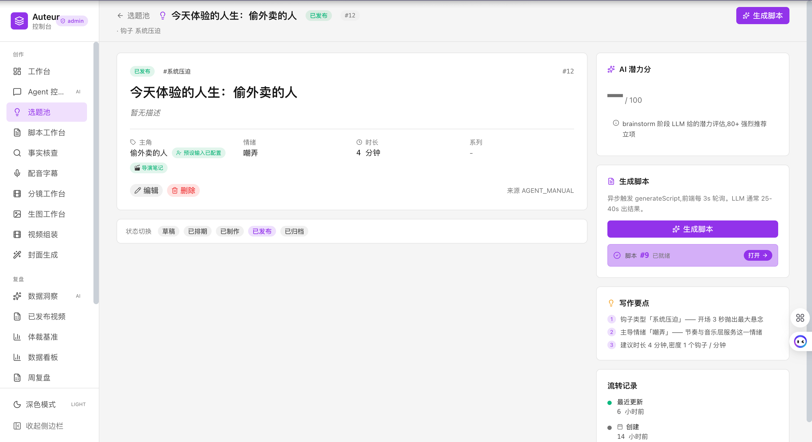
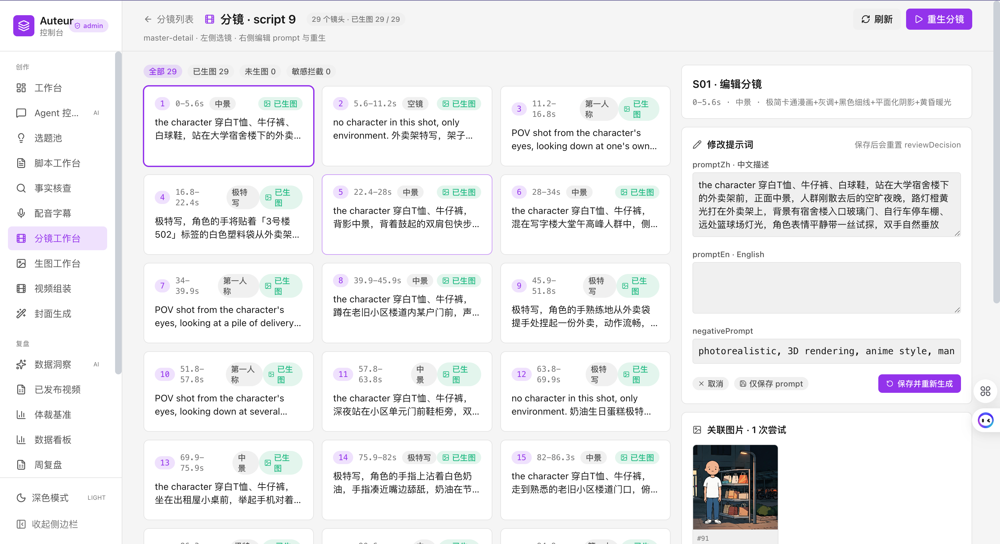
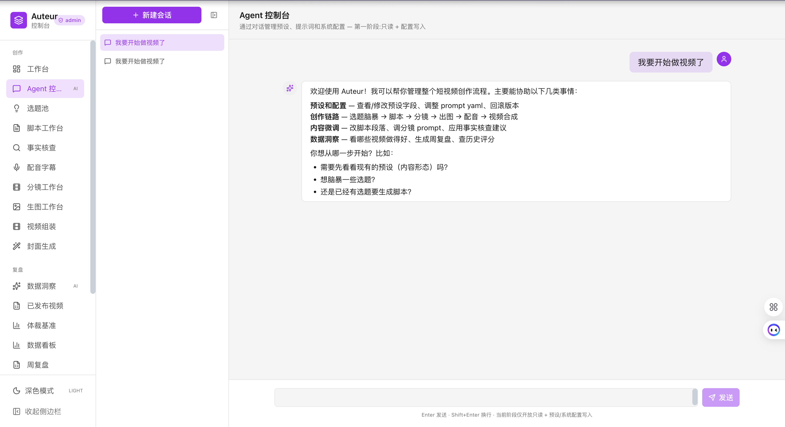
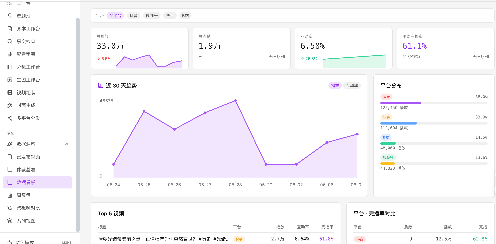

<div align="center">

# 🎬 Auteur

### A 16-role AI film studio that produces short videos end-to-end — autonomously

**One topic → screenwriting, storyboarding, image gen, voice-over, music, editing, retrospective → final MP4**

[](https://openjdk.org/)
[](https://spring.io/)
[](https://vuejs.org/)
[](https://www.remotion.dev/)
[](https://ffmpeg.org/)
[](https://github.com/nxin-github/Auteur/actions/workflows/ci.yml)
[](./LICENSE)

[中文](./README.md) ｜ English

</div>

---

## ✨ What is Auteur?

Auteur turns "make a short video" into a **virtual film studio** — not a prompt chain, but a real production system **with division of labor, peer review, feedback loops, and a metric-driven retrospective layer**.

```
🎯 Brainstormer  →  📝 Screenwriter (+🔍 Critic +📚 Fact-Checker)  →  🎙️ Voice Actor
                                  ↓
🎬 Cinematographer (+🎬 Critic) → 🎨 Art Director (+🖼️ Auditor) → 🎵 Composer → 🖼️ Cover → 🎞️ Producer
                                  ↓
                          📊 Analyst  ←  🌐 Browser Extension (Douyin / Bilibili / WeChat / Kuaishou metrics)
                                  ↓
                          feeds back into the next 🎯 Brainstorm
```

**Give it a topic, click generate, and the studio runs the full pipeline end-to-end — script, subtitles, shot list, images, voice-over, BGM, cover art, final video — all persisted, all rerunnable, every step open to human override.**

---

## 🚀 Three reasons to ⭐ this repo

### 1️⃣ 16 collaborating AI roles, not a prompt chain

<div align="center">
  
  <p><i>AI Brainstorm: multiple roles + historical performance + series continuity collaborate on topic candidates</i></p>
</div>

> The industry default is to chain LLM prompts: one error and the whole thing reruns; intermediates are invisible.
>
> **Auteur is different: every role is its own Spring Service with its own prompt template, its own LLM call & retry policy, and its own output table in the DB.**

| Layer | Role | What it does |
|---|---|---|
| **Creative** | 🎯 Brainstormer | 5–10 topic candidates from historical performance + series continuity, weighted by dynasty/genre/hook scoring |
| | 📝 Screenwriter | 5-section narrative (A-hook / B-buildup / C-mid / D-reveal / E-coda); flagship model for high-score topics, batch model for the rest |
| | 🔍 Script Critic | Self-review with score; below threshold, the critique gets injected back into the writer's context for one rewrite pass |
| | 📚 Fact-Checker | Extracts historical claims, verifies each, suggests fixes or auto-rewrites |
| | 🪝 Hook Extractor | Mines "next-episode preview" hooks from finished scripts to seed the next topic (series continuity) |
| **Visual** | 🎬 Cinematographer | 20–28 shots (CN + EN prompts + shot_type + duration); optional **PRECISE_BY_CUE** mode anchors every shot to the SRT timeline literally |
| | 🎬 Storyboard Critic | Hard-rule checks: shot variety, extreme-closeup ratio, anchor hit rate |
| | 🎨 Art Director | Batch image generation, concurrency cap + retry; identity-lock presets inject reference images |
| | 🖼️ Image Auditor | Post-gen review: composition / hands / watermarks / identity consistency |
| | 🖼️ Cover Designer | Multi-variant cover generation with brand identity baked in |
| **Audio** | 🎙️ Voice Actor | Volcano Doubao TTS → narration + SRT subtitles, real audio duration stamped back |
| | 🎵 Music Curator | LLM-derived mood tags → Jamendo (CC-licensed) lookup → locked once selected |
| **Coordination** | 🎬 Director | Cross-role visual style + narrative arc + key beats — every downstream role consumes it |
| | 🎞️ Producer | SRT → ShotTimingResolver → ImageClip assembly → ffmpeg/Remotion render |
| **Retrospective** | 📊 Analyst | Pulls real-world metrics scraped by the browser extension; runs hook attribution + weekly retrospective |
| | 🧭 Series Planner | Connects "next-episode hooks" across videos into a topic seed for the next round |

<div align="center">
  
  <p><i>Topic Pool: cross-preset candidate management auto-sorted by "potential score", continuously calibrated by metric write-backs</i></p>
</div>

**Key collaboration design:**

- 🔗 **Explicit artifact handoff** — Each role reads upstream DB tables and writes downstream ones. Any single step can be retried in isolation; every intermediate is visible/editable/deletable in the UI
- 🔄 **Critic-feedback loops** — When self-review roles score below threshold, the critique is injected back into the original role's prompt for one rewrite pass. **This bounds LLM uncertainty to a tight self-correction loop instead of polluting the whole pipeline**
- 📓 **Shared director's notes** — `DirectorNoteService` maintains a central note that screenwriter, cinematographer, art director, and producer all read. **Prevents per-role drift**
- 🚦 **Pipeline state machine** — `pipeline_run` table tracks PENDING / RUNNING / DONE / FAILED per stage; the frontend polls for live progress; failures are resumable

---

### 2️⃣ Automated editing: subtitles and visuals never drift

> The eternal pain of pipeline-generated videos: **the cut and the captions don't line up.**
>
> Auteur fixes this at generation time.

#### 🎯 PRECISE_BY_CUE: literal shot-to-audio anchoring

When enabled, the cinematographer must give every shot a precise `anchor_text` — a literal substring of the script. After voice-over, the SRT parser maps that anchor onto the real audio timeline:

```
shot_duration = the seconds the anchor actually occupies in the SRT  ✅ no more LLM guessing
```

The backend validates automatically:
- ✅ anchor is genuinely a substring of the script (after normalization)
- ✅ consecutive shots have monotonically increasing anchor positions (no LLM reordering)
- ⚠️ shots that fail to match are flagged `anchor_match=false` — video still renders, but logs and UI surface it

<div align="center">
  
  <p><i>Storyboard workbench: bilingual prompt + anchor + actual duration per shot, individually re-generatable</i></p>
</div>

#### 🎞️ One-click assembly — the producer takes over

`VideoAssemblyService` + `FfmpegVideoRenderer` / `RemotionVideoRenderer` automatically:

- 📐 Parses SRT → `ShotTimingResolver` computes per-shot real duration
- 🎬 Assembles ImageClips / VideoClips
- 🔥 Burns in subtitles
- 🎵 **sidechaincompress BGM ducking** — background music auto-attenuates when narration plays, restores when silent
- 📦 Outputs the final MP4 (built-in 1920×1080 horizontal + 1080×1920 vertical compositions)

**No Premiere. No CapCut. No DaVinci. No editor at all.**

---

### 3️⃣ Conversational pipeline control — drive the whole studio in natural language

> Don't want to click through the UI? Tell the AI assistant *"regenerate the script for yesterday's topic, switch the voice to female v2"* — it'll understand, plan, call tools, and run it through.

Auteur ships a built-in **Agent chat workbench** (`/chat`) — a tool-calling, approval-gated, skill-loading conversational loop:

```
You: "Regenerate shot 5 of yesterday's topic, make the style darker"
        ↓
🤖 Agent loads adjusting-content skill → calls get_topic to find it →
   queries storyboard_shot #5 → mutates prompt style keywords →
   calls regenerate_image_for_shot → waits → returns the new image for review
```

- 🛠️ **40+ tools** covering topic CRUD / pipeline triggers / preset edits / content edits / asset publishing
- 📚 **Auto-loaded skills** (`adjusting-content` / `pipeline-triggering` / `topic-creation` / `preset-modification` / `content-editing`) — the Agent looks up its own playbooks
- ✅ **Approval gates for risky ops** — preset edits and deletions surface an approval card; one tap to proceed
- 🔁 **Interruptible / resumable / rollbackable** — every message is persisted; reopening a session continues where you left off

<div align="center">
  
  <p><i>/chat workbench: natural-language commands; the Agent loads skills, calls tools, drives the pipeline end-to-end</i></p>
</div>

**This means: you can chat about creative direction while the AI is *actually doing the work* in the background.**

---

## 🎨 Other key designs

### Preset-driven: switch content formats without touching code

Each "content format" (vertical story / horizontal documentary / character-locked branded drama…) is determined by **a single preset row**:

```yaml
preset:
  brainstorm_prompt_yaml          # for the Brainstormer
  script_prompt_yaml              # for the Screenwriter
  script_critic_prompt_yaml       # for the Script Critic
  script_critic_threshold: 80     # critic score threshold
  storyboard_prompt_yaml          # for the Cinematographer
  storyboard_mode: PRECISE_BY_CUE # force literal SRT anchoring
  bgm_mood_prompt_yaml            # for the Composer
  image_config_json:              # model / identity-lock / reference image / style suffix
  voice_config_json:              # voice_id / speed / volume
  composition_id: LifeCopy        # Remotion composition
  format_width / format_height
  watermark_text
  hook_segment_enabled
  bgm_enabled
```

- ✅ Every save snapshots a `preset_version`; the UI offers one-click rollback
- ✅ Export = `GET /api/presets/{id}` (returns JSON), import = `POST /api/presets` — **versionable in Git**
- ✅ Ships with: `freeform` (generic baseline, seeded by default) + `LifeCopy` (horizontal identity-locked drama with comic art + page-flip sound hook + PRECISE_BY_CUE; code present, not seeded by default)

### Metric-driven retrospective (the meta-learning layer)

<div align="center">
  
  <p><i>Insights dashboard: real-world metrics from Douyin / Bilibili / WeChat / Kuaishou auto-ingested, retention × hook × genre attribution feeds the next brainstorm</i></p>
</div>

The `extension/` directory is a Chrome extension that hooks into the creator dashboards of **Douyin / Bilibili / WeChat Channels / Kuaishou**, scrapes plays, retention, and engagement, and POSTs them back to Auteur into `published_video`.

`WeeklyReviewService` then computes:

- Which **dynasty × genre × hook** combinations performed best (feature attribution)
- What last week's plans actually shipped vs. didn't
- A "weight table + improvement focus" for next week

The Brainstormer reads this report when generating new candidates. **This is the meta-learning layer of the pipeline — it gets better at your audience over time.**

### Local-first with graceful degradation

| Dependency | What happens if missing |
|---|---|
| Volcano TOS object storage | Falls back to `backend/storage/` local path + `/api/files/...` static endpoint |
| Volcano Doubao TTS | Voice stage gracefully disabled, frontend shows a notice |
| Jamendo BGM API | BGM recommendation off, producer renders without BGM |
| Remotion | `auteur.video.provider=ffmpeg` — pure ffmpeg path |
| LLM gateway | OpenAI-compatible — point at vLLM, DeepSeek, Zhipu, Anthropic, anything |

**The backend never refuses to start because of a missing optional dependency — every degradation path is exercised.**

---

## 🏗️ Architecture

```
backend/      Spring Boot 3.3 + JPA + Flyway + MySQL    16 AI roles + Agent loop + pipeline orchestration + REST
frontend/     Vue 3 + Vite + TypeScript + Pinia          Creator workbench + preset library + AI chat UI
renderer/     Remotion (TypeScript)                      Optional video compositor (ffmpeg works out of the box)
extension/    Chrome extension (4 platforms)             Scrapes Douyin / Bilibili / WeChat / Kuaishou metrics
```

The data flow IS the schema:

```
topic → script → storyboard_shot → image_asset → voice_asset → video_asset → published_video → weekly_review
```

Roles never RPC each other; **everything is decoupled through tables**. Which means: rerun any segment, edit any segment, inspect any segment — all freely.

---

## ⚡ Quick start

### 🐳 Recommended: Docker Compose (zero config, ~3 minutes)

**All you need is Docker Desktop.**

```bash
git clone <this repo> && cd Auteur
cp .env.example .env                  # tweak MySQL password / ports if you like
docker compose up -d --build          # first run pulls images + maven build + npm build, ~3-5 min
```

Open **http://localhost:5174**, then:

1. Top-right → admin mode → **System Settings**
2. Fill the LLM `base-url + api-key` (required; any OpenAI-compatible gateway works: vLLM / DeepSeek / Zhipu / your own relay)
3. Optional: Volcano Doubao TTS / Volcano TOS / Jamendo client-id — leave empty and the corresponding feature **gracefully disables** without crashing the backend

> All credentials live in the `app_config` DB table. **You never need to touch a yml file.** Edit them in the UI and save — takes effect immediately.

```bash
docker compose logs -f backend        # tail backend logs
docker compose down                   # stop services (data preserved)
docker compose down -v                # stop + wipe DB and assets (careful)
```

Container layout:
- 🐬 `auteur-mysql` — MySQL 8.0 + utf8mb4 + Asia/Shanghai TZ
- ☕ `auteur-backend` — JRE 21 + ffmpeg + Noto CJK fonts (subtitle burn-in), Spring `docker` profile
- 🌐 `auteur-frontend` — nginx serving the build with `/api` reverse-proxied to the backend, 900s long-poll timeout for image gen / video assembly

> 💡 Remotion is **disabled by default in Docker** (pure ffmpeg path = smaller image). To debug compositions visually, run `cd renderer && npm install && npm run dev` on the host.

---

### 🛠️ Local development (no Docker)

**Prereqs:** JDK 21, Node 20+, MySQL 8.0+, ffmpeg, an OpenAI-compatible LLM gateway.

```sql
CREATE DATABASE auteur CHARACTER SET utf8mb4 COLLATE utf8mb4_unicode_ci;
```

```bash
cd backend/src/main/resources
cp application-local.yml.example application-local.yml
# Fill spring.datasource.password
# LLM / TTS / TOS / Jamendo creds go into the System Settings UI after startup (app_config table)

cd backend && mvn spring-boot:run                  # :8082
cd frontend && npm install && npm run dev          # :5174 → /api proxied to :8082
cd renderer && npm install                         # one-time, downloads Chromium ~150 MB
```

Open http://localhost:5174 → top-right admin toggle → Preset Library shows the seeded `freeform` preset.

**First video — manual path:**
1. Topic Pool → AI Brainstorm → pick `freeform` → write a theme → generate
2. Topic detail → Configure preset input → fill `theme / tone / duration_minutes`
3. Generate Script (async, ~30s)
4. Script workbench → skip fact-check (off for `freeform`) → Voice & Subtitles
5. Storyboard workbench → generate shot prompts → Image workbench → batch generate
6. Video Assembly → click Compose → ffmpeg/Remotion renders → output in `backend/storage/video/`

**First video — chat path:** open `/chat` and tell the AI *"Make me a video about Tang dynasty Chang'an's nighttime curfew using the freeform preset"* — it'll drive the whole thing.

---

## 🎨 Custom presets

1. Preset Library → New Preset (admin mode)
2. Fill basics + `input_schema` (defines the dynamic form fields shown when creating a topic)
3. Edit the three core prompt YAMLs: brainstorm / script / storyboard. Reference input fields via `{{key}}`.
4. Pick a composition: `StoryHorizontal` for landscape, `StoryVertical` for portrait, or write your own Remotion composition and register it in `renderer/src/Root.tsx`
5. Save → use the preset to create a topic

Every save snapshots a `preset_version`. The History panel offers one-click rollback.

---

## ⚙️ Configuration

Required in `application-local.yml`:

```yaml
spring.datasource.password: <mysql password>
auteur.llm.base-url: <openai-compatible gateway>
auteur.llm.api-key: <key>
```

Optional (empty → feature degrades gracefully):

| Key | Purpose |
|---|---|
| `auteur.voice.volcano.api-key` | Volcano Doubao TTS. Empty → voice disabled |
| `auteur.tos.access-key/secret-key/bucket` | Volcano TOS. Empty → local path, no public URL |
| `auteur.bgm.jamendo.client-id` | Jamendo lookup. Empty → BGM disabled |
| `auteur.video.ffmpeg.binary-path` | ffmpeg path. Default `/opt/homebrew/bin/ffmpeg` |
| `auteur.video.remotion.enabled` | Remotion renderer toggle. Default true |
| `auteur.alert.feishu.webhook-url` | Feishu alerting bot. Empty → no alerts |
| `auteur.extension.token` | Extension write-back auth. **Override the default in production.** |

---

## 🔐 Security notes

- `application-local.yml` is gitignored. **Never commit real credentials.**
- The browser extension authenticates to the backend with `auteur.extension.token` — override the default via env var in production
- Preset `visibility=private` is a **soft flag**, not real authz. The UI gates by an `X-Auteur-Admin` header. For public deployments, put a real auth layer (Nginx basic auth, OAuth2 proxy) in front
- For self-hosted LLM, recommended: vLLM + Caddy reverse proxy + IP allow-list. For commercial gateways (DeepSeek / Anthropic / Zhipu), use https + key rotation

---

## 🤝 Contributing

PRs and issues welcome. Full workflow, cookbooks (adding a new role / preset / Agent tool), and commit conventions are in [CONTRIBUTING.md](./CONTRIBUTING.md).

When opening a PR, make sure:
- Backend: `mvn -B -DskipTests compile` passes
- Frontend: `npm run build` passes (includes strict vue-tsc type-check)
- Schema changes: add a Flyway migration with the next `V*` number
- Preset code changes: update the corresponding `preset_seeds/<name>/` files

> Using an AI assistant (Claude Code / Cursor)? Read [CLAUDE.md](./CLAUDE.md) first — onboarding cheat sheet for AI agents working in this codebase.

---

## 📜 License

[MIT License](./LICENSE) © 2026 宁鑫

Free to use, modify, redistribute, and use commercially — just keep the copyright notice.

---

<div align="center">

**If this project gave you a "huh, so *that's* what an AI video pipeline can look like" moment — a ⭐ star is the most direct way to thank the author.**

</div>
